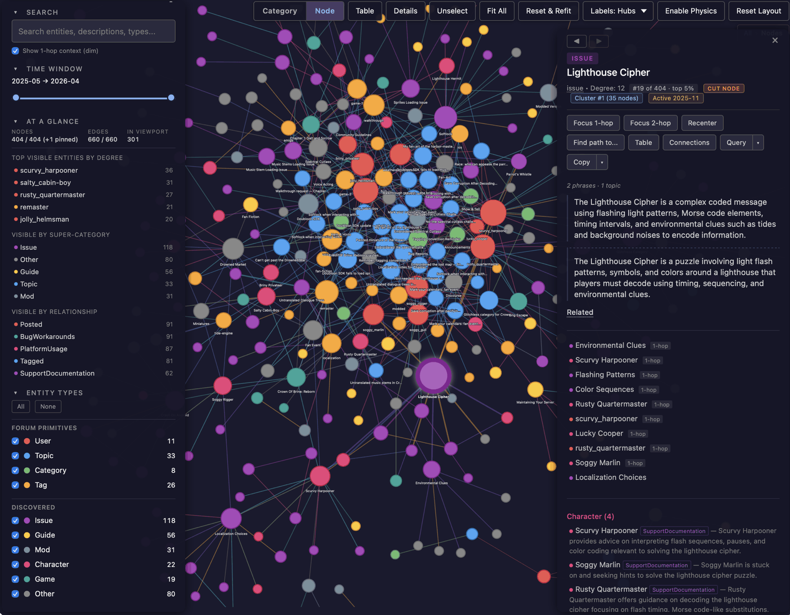

# Discourse Explorer

Scrape, analyze, and explore discussions from any Discourse forum.

### What it does

1. **Scrape** — Download all topics, posts, and metadata as structured JSON. Supports delta sync.
2. **Analyze** — DuckDB analytics (tag distribution, top contributors, activity trends, keyword search, SQL REPL).
3. **Discover** — Derive an entity-type vocabulary tailored to your forum by sampling topics with an LLM. Drives extraction quality in step 4.
4. **Query** — Ask natural-language questions using a local GraphRAG knowledge graph (LightRAG + OpenAI/Ollama).
5. **Visualize** — Interactive HTML graph explorer: entities, relationships, communities.

Everything runs locally — no cloud services required except LLM calls if you opt for OpenAI and the initial scrape.

<a id="screenshot"></a>
<p align="center">
  
</p>

## Setup

Requires Python ≥ 3.10 and [uv](https://docs.astral.sh/uv/). For GraphRAG features, also install [Ollama](https://ollama.com/) or bring an OpenAI key.

```bash
uv sync
```

### Try the demo (no Discourse, no LLM)

A committed fixture under `sample/fixtures/seed42-tiny/` carries a full deterministic forum (33 topics / 116 posts, 404 KB of JSON) plus the ~10 MB of GraphRAG artefacts the offline tools need. Try the analyzer + visualizer end-to-end without scraping anything:

```bash
uv run discourse-explorer stats --path sample/fixtures/seed42-tiny categories
uv run discourse-explorer visualize sample/fixtures/seed42-tiny --open
```

The fixture comes from the synthetic-forum seeder under `sample/` — see [`sample/README.md`](sample/README.md) for the Docker-stack path that lets you regenerate it locally and test the live `init` / `extend` paths against a real Discourse instance.

### Configuration in two tiers

A single checkout supports multiple forums: the project root has a 1-line *selector*, each forum has its own config directory.

```bash
# 1. Selector at project root (one line, points at whichever forum is "active")
echo 'DISCOURSE_DATA_DIR=./data/my-forum' > .env

# 2. Per-forum config (URL, auth, models, gleaning — all env vars for this corpus)
mkdir -p ./data/my-forum/config
cp discourse_explorer/config/env.example ./data/my-forum/config/.env
# edit ./data/my-forum/config/.env
```

Priority when both dotenv files set the same key: data-dir wins. Shell exports override both. CLI flags override everything.

Full env-var reference and layering rules: **[`docs/analysis/vocabulary-and-config.md`](docs/analysis/vocabulary-and-config.md)**.

### Authentication

Edit `<data-dir>/config/.env` and pick **one**:

| Method | Env vars | Notes |
|---|---|---|
| **API key** (preferred) | `DISCOURSE_API_KEY` + `DISCOURSE_API_USERNAME` | Generate at Discourse Admin → API → New API Key. |
| **Session cookie** (fallback) | `DISCOURSE_COOKIE` | F12 → Cookies → copy `_t` value. Expires in a few weeks. |
| **OIDC / Keycloak** | `DISCOURSE_USERNAME` + `DISCOURSE_PASSWORD` | Automated SSO. May not work with all setups. |

Priority at runtime: API key ≻ cookie ≻ OIDC.

Also set `DISCOURSE_URL=https://discourse.example.com` in the same file for unflagged scraper runs.

## Tools at a glance

| Tool | Purpose | Reference |
|---|---|---|
| `scrape` | Download topics + posts + metadata; delta sync | [Manual §1](docs/MANUAL.md#1-scraping) |
| `stats` | DuckDB analytics + SQL REPL | [Manual §2](docs/MANUAL.md#2-analytics) |
| `discover-types` | Distill an entity-type vocabulary from sampled topics | [Manual §3 — Discover](docs/MANUAL.md#discover-entity-types-recommended-before-first-index) |
| `query` | Build the knowledge graph (`--index`) and ask questions | [Manual §3 — Build](docs/MANUAL.md#build-the-knowledge-graph) · [Ask](docs/MANUAL.md#ask-questions) |
| `visualize` | Render the interactive HTML graph explorer | [Manual §4](docs/MANUAL.md#4-graph-visualization) |
| Coding-agent skills | Guided end-to-end workflows for Claude Code and Codex | [Manual — Guided workflows](docs/MANUAL.md#guided-workflows-via-claude-code-and-codex) |

> **Indexing runs for minutes to hours — launch it with `scripts/index.sh`, not the bare CLI.**
> ```bash
> DISCOURSE_DATA_DIR=<data-dir> ./scripts/index.sh --resume   # add new topics, replace edited ones (cheap)
> DISCOURSE_DATA_DIR=<data-dir> ./scripts/index.sh --full     # DESTRUCTIVE full rebuild
> ```
> The script detaches the run into its own session so it survives the shell, refuses to start a second indexer on the same data dir, and reports failure instead of printing a PID for a run that already died. A mode is required — there is no default, because the destructive one would be a poor thing to get by typo.
>
> `--resume` skips topics whose content is unchanged, and for a topic that *did* change it deletes the documents that topic produced last time before re-seeding it. Without that step an edit accretes: a renamed tag or a departed poster stays in the graph forever alongside its replacement. Watch the `N stale doc(s) purged` field in the `Pass 1 complete:` line to see it happen.

## Coding-agent compatibility

Claude Code and Codex share one instruction and skill source. `AGENTS.md` links to `CLAUDE.md`, `sample/AGENTS.md` links to `sample/CLAUDE.md`, and `.agents/skills` links to the canonical `.claude/skills` directory. There are no copied skill files to synchronize.

All host-specific tool and model bindings are configured once in [`.claude/skills/HOST-COMPATIBILITY.md`](.claude/skills/HOST-COMPATIBILITY.md). Its `ROUTER` and `EXECUTOR` table is the single place to select a different executor model for Claude Code or Codex. Individual `SKILL.md` files deliberately use semantic operations such as “ask the user” and “delegate execution”; do not add host API names or model IDs to them.

To support another agent harness, add its bindings to the compatibility contract and expose the canonical `.claude/skills` directory through that harness's native discovery path or a symlink. If the harness cannot follow symlinks, configure it to read the canonical directory directly rather than maintaining a copied skill tree.

Executor availability is checked at the point each host can observe it. Claude Code checks its documented environment override but cannot detect every organization allowlist fallback from inside a session. Codex requests its configured executor model explicitly and reports a rejected spawn before any fallback. A host without a suitable subagent runs the resolved work in the main conversation and states that the executor-tier optimization was unavailable. The compatibility contract contains the exact behavior and current bindings.

## Documentation

- **[`docs/MANUAL.md`](docs/MANUAL.md)** — per-tool usage reference: CLI flags, env vars, examples, the end-to-end workflow.
- **[`AGENTS.md`](AGENTS.md) / [`CLAUDE.md`](CLAUDE.md)** — shared maintainer-facing map of the codebase and invariants.
- **[`docs/analysis/`](docs/analysis/)** — deep-dives on indexing, canonicalization, visualization, configuration.
- **[`docs/lightrag/`](docs/lightrag/)** — read before editing `query.py` or `discover_types.py`.
- **[`docs/discourse/`](docs/discourse/)** — Discourse JSON shape + terminology.
- **[`docs/ideas/`](docs/ideas/)** — forward-looking proposals.
